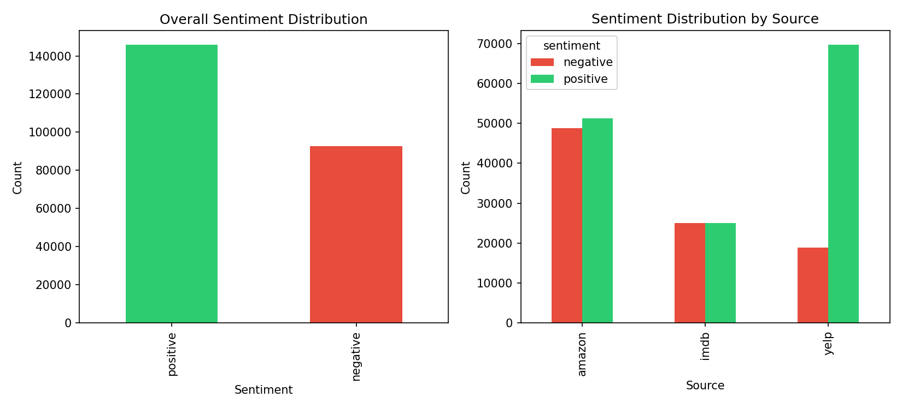
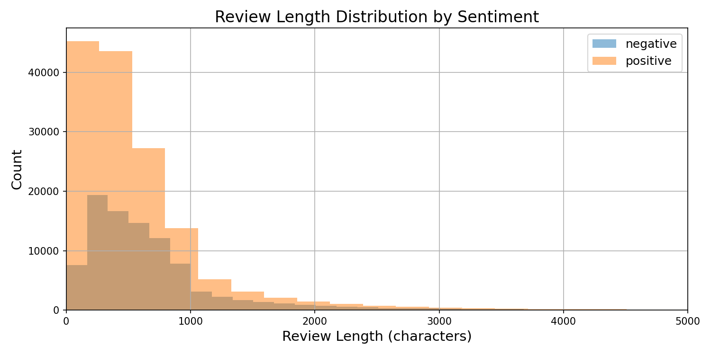
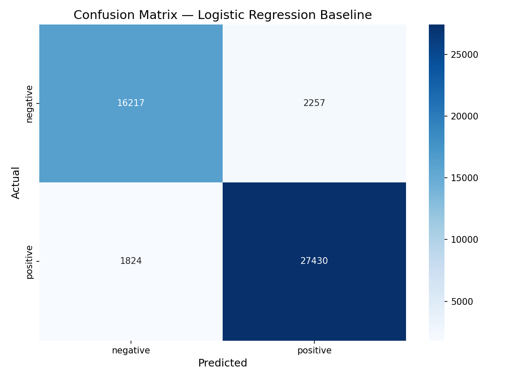

# Sentiment Analysis Tool

A general-purpose sentiment analysis tool that classifies text reviews as positive or negative, trained on 238K+ reviews from three domains.

## Project Overview

**Problem:** Businesses, researchers, and individuals need to quickly understand sentiment in large volumes of text data.

**Solution:** A sentiment classifier built with TF-IDF and Logistic Regression, achieving 91.4% accuracy on unseen data.

## Target Users

| User                   | Use Case                            |
| ---------------------- | ----------------------------------- |
| Small business owners  | Scan customer feedback quickly      |
| E-commerce sellers     | Monitor product reviews at scale    |
| Product managers       | Track feature reception post-launch |
| Customer support       | Prioritize urgent/negative tickets  |
| Marketing teams        | Measure campaign sentiment          |
| Researchers / Students | Analyze public opinion datasets     |

## Project Structure

```
sentiment-analysis-project/
├── data/
│   ├── raw/               # Original datasets (not tracked)
│   └── processed/         # Visualizations and cleaned data
├── notebooks/
│   ├── 01_data_exploration.ipynb
│   ├── 02_data_cleaning.ipynb
│   └── 03_baseline_model.ipynb
├── models/
│   ├── logistic_regression_baseline.pkl
│   └── tfidf_vectorizer.pkl
├── README.md
├── requirements.txt
└── .gitignore
```

## Datasets

| Dataset | Domain | Size Used | Source |
|---------|--------|-----------|--------|
| IMDB Reviews | Entertainment | 50,000 | [Kaggle](https://www.kaggle.com/datasets/lakshmi25npathi/imdb-dataset-of-50k-movie-reviews) |
| Amazon Reviews | E-commerce | 100,000 | [Kaggle](https://www.kaggle.com/datasets/bittlingmayer/amazonreviews) |
| Yelp Reviews | Local business | 88,638 | [Kaggle](https://www.kaggle.com/datasets/yelp-dataset/yelp-dataset) |
| **Combined** | **Multi-domain** | **238,638** | |

## Current Results

| Metric | Negative | Positive | Overall |
|--------|----------|----------|---------|
| Precision | 90% | 92% | 91% |
| Recall | 88% | 94% | 91% |
| F1 Score | 89% | 93% | 91% |
| **Accuracy** | — | — | **91.4%** |

## Features

- [x] Multi-domain training (Amazon, IMDB, Yelp)
- [x] Text preprocessing pipeline (HTML removal, normalization)
- [x] TF-IDF + Logistic Regression baseline (91.4% accuracy)
- [x] Model evaluation (precision, recall, F1, confusion matrix)
- [x] Custom review prediction
- [ ] Model comparison (Naive Bayes, SVM, Random Forest)
- [ ] Deep learning (DistilBERT fine-tuning)
- [ ] Explainability (SHAP/LIME)
- [ ] Bias analysis
- [ ] Streamlit web app

---

## Phase 1: Data Exploration (`01_data_exploration.ipynb`)

Loaded and explored the IMDB dataset to understand the data structure.

```python
import pandas as pd

imdb_df = pd.read_csv('../data/raw/IMDB Dataset.csv')
print(f"Dataset shape: {imdb_df.shape}")
print(imdb_df['sentiment'].value_counts())
```

**Results:**
```
Dataset shape: (50000, 2)
positive    25000
negative    25000
```

```python
# Check review lengths
imdb_df['review_length'] = imdb_df['review'].apply(len)
print(imdb_df['review_length'].describe())
```

**Results:**
```
mean      1309.43
min         32.00
max      13704.00
```

**Key Finding:** 58% of IMDB reviews contained HTML tags — cleaning was essential.

---

## Phase 2: Data Cleaning (`02_data_cleaning.ipynb`)

Built a text cleaning pipeline and processed all three datasets.

### Text Cleaning Function

```python
import re

def clean_text(text):
    text = text.lower()
    text = re.sub(r'<.*?>', '', text)       # Remove HTML tags
    text = re.sub(r'[^a-z\s]', '', text)    # Keep only letters and spaces
    text = re.sub(r'\s+', ' ', text).strip() # Remove extra whitespace
    return text
```

**Before:** `"This is a <br />GREAT movie!!! I'd rate it 10/10"`
**After:** `"this is a great movie id rate it"`

### Loading All Three Datasets

```python
# IMDB - CSV format
imdb_data = pd.read_csv('../data/raw/IMDB Dataset.csv')

# Amazon - Compressed .bz2 format
import bz2
amazon_df = load_amazon_data('../data/raw/train.ft.txt.bz2', num_samples=100000)

# Yelp - JSON Lines format
yelp_df = pd.read_json('../data/raw/yelp_academic_dataset_review.json', lines=True, nrows=100000)

# Convert Yelp stars to sentiment (1-2 = negative, 4-5 = positive, drop 3)
star_mapping = {1: 'negative', 2: 'negative', 4: 'positive', 5: 'positive'}
yelp_df['sentiment'] = yelp_df['stars'].map(star_mapping)
yelp_df = yelp_df.dropna(subset=['sentiment'])
```

### Combining Datasets

```python
combined_data = pd.concat([imdb_clean, amazon_clean, yelp_clean], ignore_index=True)
combined_data.to_csv('../data/processed/combined_reviews_clean.csv', index=False)
```

**Results:**

| Dataset | Domain | Reviews | Format |
|---------|--------|---------|--------|
| IMDB | Entertainment | 50,000 | CSV |
| Amazon | E-commerce | 100,000 | Compressed .bz2 |
| Yelp | Local business | 88,638 | JSON Lines |
| **Combined** | **Multi-domain** | **238,638** | |

### Visualizations

| Sentiment Distribution | Review Length Distribution |
|:---:|:---:|
|  |  |

---

## Phase 3: Baseline Model (`03_baseline_model.ipynb`)

Built and evaluated a TF-IDF + Logistic Regression classifier.

### Train/Test Split

```python
from sklearn.model_selection import train_test_split

X = df['clean_review']
y = df['sentiment']
X_train, X_test, y_train, y_test = train_test_split(X, y, test_size=0.2, random_state=42)
```

**Result:** Training: 190,908 reviews | Test: 47,728 reviews

### TF-IDF Vectorization

```python
from sklearn.feature_extraction.text import TfidfVectorizer

tfidf = TfidfVectorizer(max_features=50000)
X_train_tfidf = tfidf.fit_transform(X_train)
X_test_tfidf = tfidf.transform(X_test)
```

**Result:** Each review converted to a vector of 50,000 features

### Model Training

```python
from sklearn.linear_model import LogisticRegression

model = LogisticRegression(max_iter=1000)
model.fit(X_train_tfidf, y_train)
```

**Result:** Trained in 1.7 seconds on 190K reviews

### Evaluation

```python
from sklearn.metrics import accuracy_score, classification_report

y_pred = model.predict(X_test_tfidf)
print(f"Accuracy: {accuracy_score(y_test, y_pred):.4f}")
print(classification_report(y_test, y_pred))
```

**Results:**
```
              precision    recall  f1-score   support
    negative       0.90      0.88      0.89     18474
    positive       0.92      0.94      0.93     29254
    accuracy                           0.91     47728
```

### Confusion Matrix



| | Predicted Negative | Predicted Positive |
|---|---|---|
| **Actual Negative** | 16,217 | 2,257 |
| **Actual Positive** | 1,824 | 27,430 |

### Custom Review Test

```python
my_reviews = [
    "This product is absolutely amazing, I love it!",
    "Terrible experience, worst purchase I ever made.",
    "It was okay, nothing special but not bad either.",
    "The quality is outstanding and the price is fair.",
    "Broke after two days. Total waste of money."
]
my_reviews_tfidf = tfidf.transform(my_reviews)
predictions = model.predict(my_reviews_tfidf)
```

| Review | Prediction |
|--------|-----------|
| "This product is absolutely amazing, I love it!" | positive |
| "Terrible experience, worst purchase I ever made." | negative |
| "It was okay, nothing special but not bad either." | negative |
| "The quality is outstanding and the price is fair." | positive |
| "Broke after two days. Total waste of money." | negative |

---

## Installation

```bash
git clone https://github.com/ogaga-ai/sentiment-analysis-project.git
cd sentiment-analysis-project
pip install -r requirements.txt
```

## Usage

```python
import joblib

# Load the saved model and vectorizer
model = joblib.load('models/logistic_regression_baseline.pkl')
tfidf = joblib.load('models/tfidf_vectorizer.pkl')

# Predict sentiment on any text
review = "This product is absolutely amazing!"
review_tfidf = tfidf.transform([review])
prediction = model.predict(review_tfidf)

print(prediction)  # ['positive']
```

## Limitations & Ethical Considerations

This model has known limitations:

- **Sarcasm/Irony:** May misclassify sarcastic statements
- **Dialect bias:** Trained primarily on standard English
- **Domain shift:** Performance varies across different review types
- **Neutral text:** Forced into positive/negative — no neutral option
- **Context:** Cannot understand broader context or nuance

### Responsible Use

This tool should NOT be used for:

- Surveillance of individuals without consent
- Automated decision-making without human oversight
- Suppressing legitimate negative feedback

## License

MIT License

## Acknowledgments

- Kaggle for datasets
- scikit-learn for ML tools
